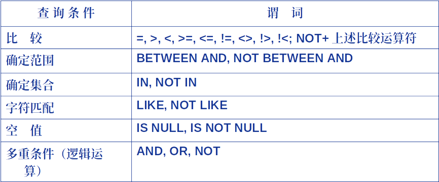

# Ch13 SQL数据查询(单表)

## 数据查询
```SQL
SELECT [ALL|DISTINCT] <目标列表达式>[,<目标列表达式>]... FROM <表名或视图名>[,<表名或视图名>]... | (SELECT 语句) [AS] <别名>
[WHERE <条件表达式>] [GROUP BY<列名1> [HAVING <条件表达式>]] [ORDER BY <列名2>[ASC|DESC]];
```
- SELECT子句: 指定要显示的属性列 **选择加投影**
- FROM子句: 指定查询对象(基本表或视图)
- WHERE子句: 指定查询条件
- GROUP BY子句: 对查询结果按制定列的值分组, 该属性列相等的元组为一个组, 通常会在每组中作用聚集函数 *比如求和*
- HAVING 子句: 只有满足制定条件的组才予以输出
- ORDER BY子句: 对查询结果表按指定列的排序

```SQL
SELECT * FROM Student;
```
查询Student表中的全部列

<目标列表达式>不仅可以为表中有的属性列, 也可以通过表达式创建表中没有的属性列

```SQL
(SELECT 语句) [AS] <别名>
```
可以给查询的列起别名, 这样显示的结果的属性名就是别名了


DISTINCT关键词, 去除查询结果中的重复的行, 默认为ALL

### 查询满足条件的元组


字符匹配
```SQL
[NOT] LIKE '<匹配串>' [ESCAPE '<换码字符>']
```
- <匹配串>可以是一个完整的字符串, 也可以含有通配符 %和 _
- %表示任意长度的字符串
- _表示任意单个字符
- 使用换码字符将通配符转义为普通字符, 一般的编程语言中使用'\'作为换码字符, 这里ESCAPE的作用就是你可以自定义换码字符


设计空值的查询
```IS NULL``` 或 ```IS NOT NULL```, 不可以用 = 替代IS

### 聚集函数
常见的聚集函数如下
- ```COUNT(*)``` 统计元组个数
- ```COUNT([DISTINCT|ALL] <列名>)``` 统计一列中值的个数
- ```SUM([DISTINCT|ALL] <列名>)``` 计算一列值的总和(此列必须为数值型)
- ```AVG([DISTINCT|ALL] <列名>)``` 计算平均值
- ```MIN([DISTINCT|ALL] <列名>)``` 计算最小值
- ```MAX([DISTINCT|ALL] <列名>)``` 计算最大值


聚集函数常和GROUP BY子句一起使用, **细化聚集函数的作用对象**
- 如果未对查询结果进行分组, 聚集函数将作用于整个查询结果
- 分组后, 将分别作用于每一组
- 按指定的一列或多列值分组, 值相等的为一组

HAVING短语与WHERE子句的区别
- 作用对象不同
  - WHERE子句作用于基本表或视图, 从中选择满足条件的元组
  - HAVING短语作用于GROUP BY分的组, 从中选择满足条件的组
- WHERE子句不能用聚集函数作为条件表达式
- HAVING短语可以